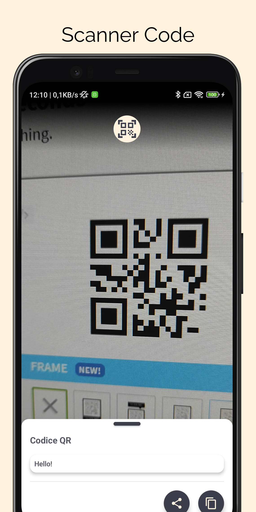

# Scanner Code
> <b>Author: Nicola De Nicolais</b>

## 📄 Description
Android application built with Kotlin and Jetpack Compose that allows you to scan QR codes and barcodes. In the app it's possible to copy the content of the code or share it with other applications.<br/>

## 🔨  How to install and run the project
Clone this repository :<br/>
`
git clone https://github.com/ndenicolais/ScannerCode.git
`

Import the project into Android Studio :

1. File -> New -> Import Project
2. Browse to <path_to_project>
3. Click "OK"

Create a new virtual device or connect an Android device to your computer.</br>
Click Run to start the project on the selected device.

## 🛠️ Built with
Kotlin</br>
Jetpack Compose

## 📚 Package Structure

```
com.denicks21.scannercode       # ROOT PACKAGE
│
├── data                        # DATA FOLDER
|   ├── DataSourceModule        # Inject repository in the ScanLDS.
|   ├── RepositoryModule        # Inject repository in the ScanRepository.
|   ├── ScanLDS                 # Manages the device’s camera for scanning codes.
|   ├── ScanMapper              # Scan object conversion.
|   ├── ScanRepository          # Repository operations.
|   ├── ScanRepositoryImpl      # ScanRepository implementation.
|
├── model                       # MODEL FOLDER
|   ├── Scan                    # Scan model.
|
├── navigation                  # NAVIGATION FOLDER
│   ├── NavGraph                # Contains all of app destinations and actions.
│   └── NavScreens              # Contains a sealed class with object corresponds to a screen and its routes.
|
├── scanner                     # SCANNER FOLDER
│   ├── ScannerEvent            # Class representing events related to the QR code/barcode scanning functionality.
│   └── ScannerPage             # Scan main page.
│   └── ScannerUiState          # Class representing the state of the user interface associated with the QR/barcode code scanning feature.
│   └── ScannerViewModel        # Scan ViewModel.
|
├── ui                          # UI FOLDER
│   ├── theme                   # THEME FOLDER
|   │   ├── Color               # Color palette used by the app.
|   │   ├── Shape               # Components shapes of Compose used by the app.
|   │   ├── Theme               # Theme used by the app.
|   │   ├── Type                # Typography styles for the fonts used by the app.
|
│   ├── components              # COMPONENTS FOLDER
|   │   ├── CameraDialog        # .
|   │   ├── ScanSheet           # .
|   │   ├── TopBar              # Bar that represent the app name and drawer menu.
|
├── MainActivity                # Main activity
```

## 📎 Screenshots
<p float="left">

